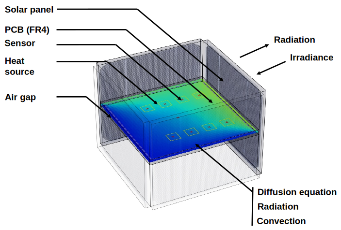
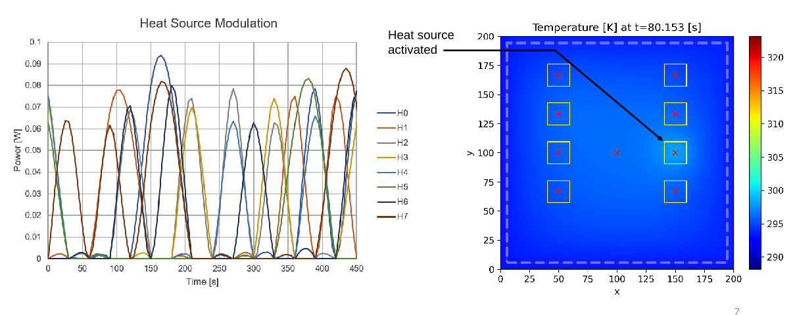
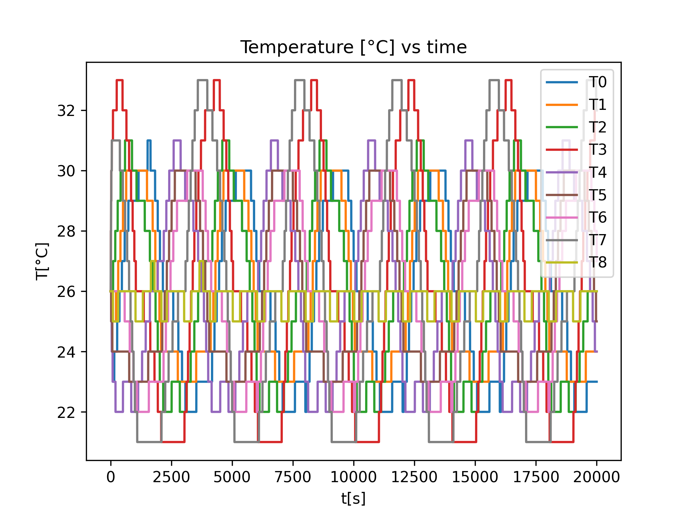

<!-- # Simplified Thermal Simulation of an EPS Motherboard -->
# Simplified Thermal Simulation of an EPS of a Cubesat to Generate Quantized Temperature Sensor Data at given Locations.

This repository is a side project of the [AtMonSat](https://github.com/andre-stemper/ATMonSAT) project.  

> The AtMonSat project was partly funded by the European Space Agency (ESA) under the Open Space Innovation Platform (OSIP), under which ESA organizes and launches Campaigns and Channels to seek ideas related to space research, otherwise known as ESAIdeas.
> Reference:  
> ESA Contract No.~400134792/21/NL/GLC/my  
> ESA activity description No.~I-2020-03332  

The EPS thermal simulator has been developed in the context of the ATMonSat project to generate simulated temperature sensor data to allow us to train and evaluate anomaly detection models while experimental data from a Cubesat was still not available.

Simulated data has the additional features that it is possible to reproduce exactly the same sequence with and without an anomaly.  

## Features
 - 2D transient thermal simulation 
 - Python based, scriptable scenarios
 - Key-frame scriptable (e.g. irradiance angle)
 - Constant and modulated heat sources 
 - Material regions definable 
 - Multiprocessor support

## Physical Model

The simulation of the PCB, air gap and heat sources is based on solving the diffusion equation in 2D using the Finite-Difference Time-Domain (FDTD) method. 

$$ \frac{\partial T(x,y,t)}{\partial t} = \alpha \frac{\partial^2 T(x,y,t)}{\partial x^2} + 
\alpha \frac{\partial^2 T(x,y,t)}{\partial y^2} + \frac{g(x,y,t)}{\rho\cdot c_p}$$

where 
$$
\alpha = \frac{\kappa}{\rho\cdot c_p}
$$
with
$\kappa$ : conductivity $[\frac{W}{m \cdot K}]$
$\rho$ : density $\frac{kg}{m^3}$
$c_p$ : specific heat capacity $[\frac{J}{kg\cdot K}]$

The model includes surface convection (experimental measurements are done in a lab not in space environment) and radiation.

For the solar panels the simulation considers irradiance (angle, intensity) as well as radiative loss.

The simulation allows specifying heat sources (yellow rectangles) that can be key-frame controlled or controlled by an external CSV file. Key-frame based control allows moving the position of the sources.

The latent data for the different temperature sensors are sampled at the locations indicted by a red marks.
The latent data is then quantized to 1 degree resolution.

